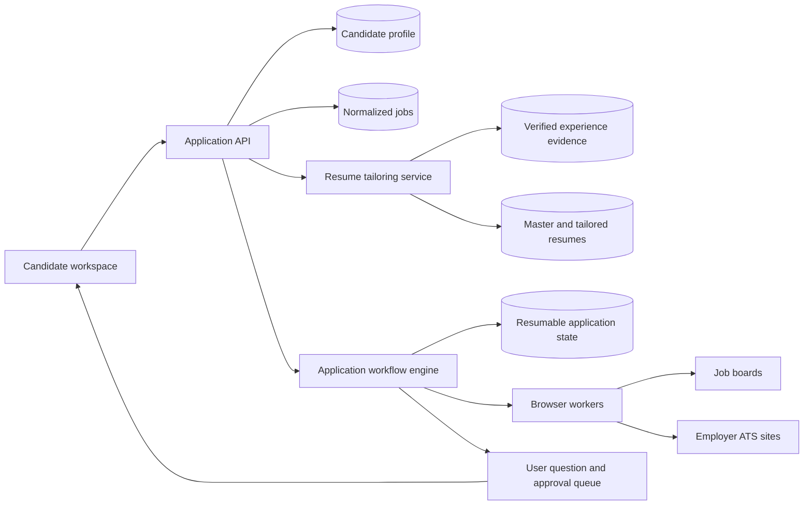

# Architecture

## Core boundaries

- **Discovery adapters** collect public job metadata and posting age.
- **Matching** applies candidate preferences and verified skills.
- **Resume tailoring** produces a separate artifact for each job and records its evidence sources.
- **Workflow engine** stores every completed step and can resume after interruption.
- **Browser workers** handle each supported job board or ATS flow.
- **User queue** receives CAPTCHA, MFA, assessments, unknown questions, attestations, and signature steps.
- **Submission ledger** stores the final resume, answers, timestamps, and confirmation evidence.

